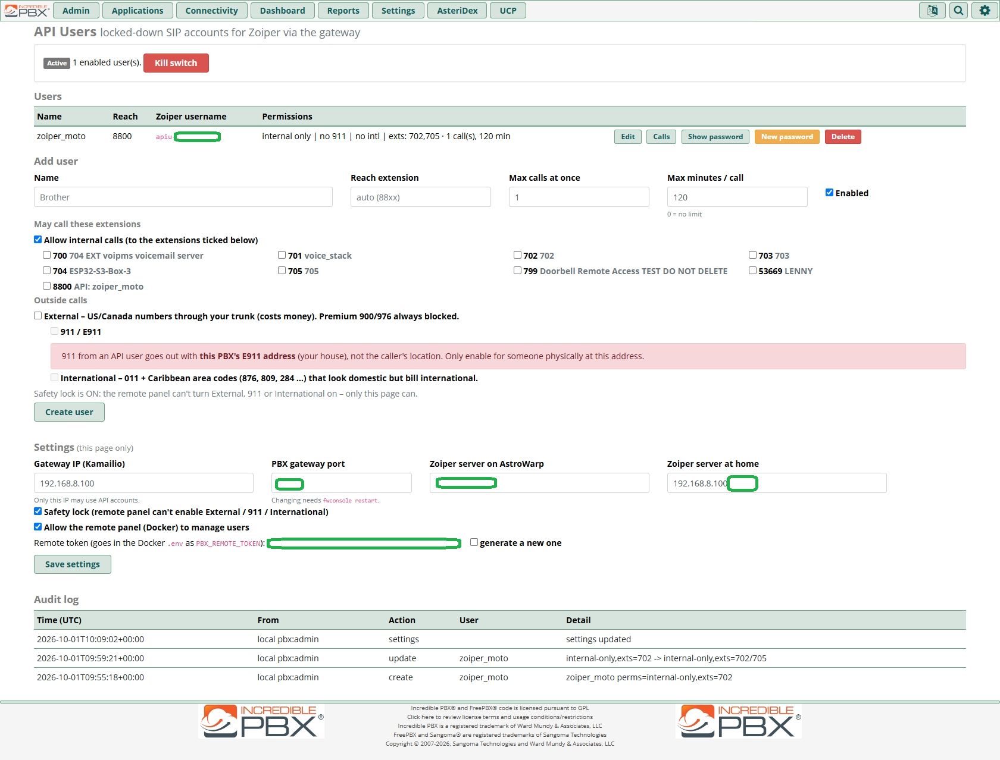
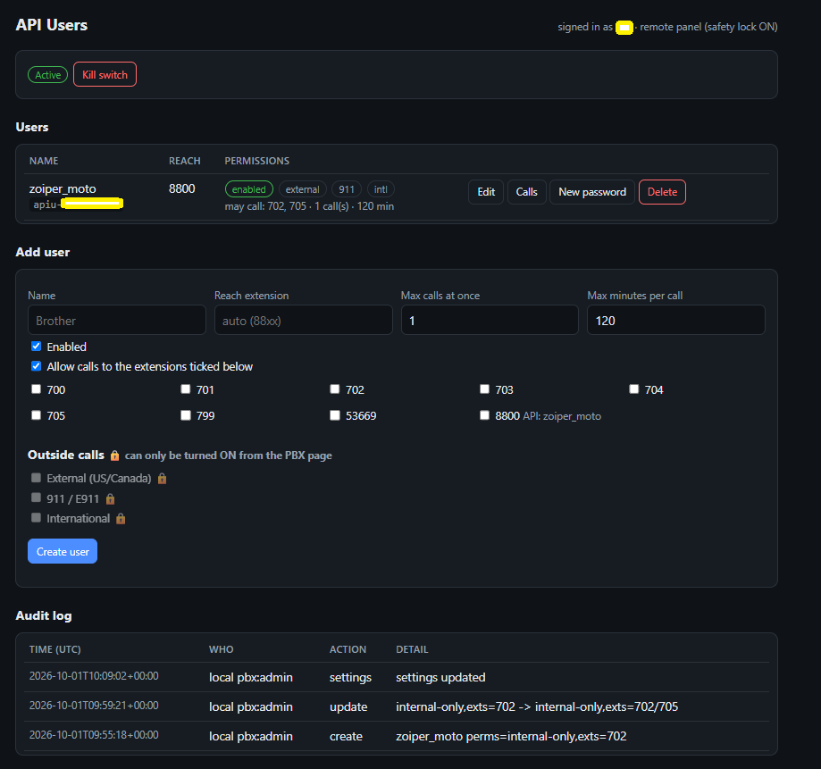
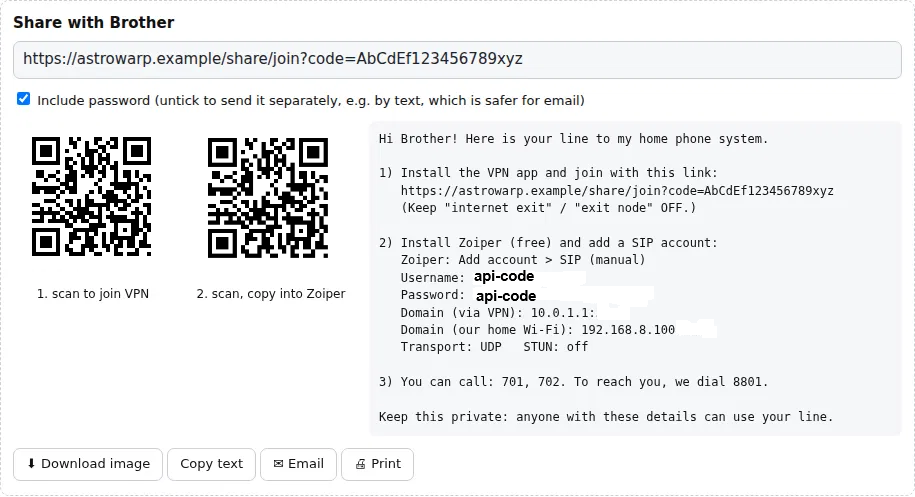

# PBX API Users Gateway

**Give people a phone line into your home PBX, without giving them your PBX.**

This project lets you hand out locked-down SIP accounts for **Incredible PBX / FreePBX 17**.
Use them in Zoiper or any SIP app. They are not real extensions, the PBX is never exposed to
the internet, and you decide exactly what each person can dial:

| Permission | What it means |
|---|---|
| **Internal (whitelist)** | Call only the extensions you tick, e.g. *my brother can call 701 and 702, nothing else* |
| **External** | US/Canada numbers through your trunk. Premium 900/976 numbers are **always** blocked |
| **911 / E911** | Off by default, with a big warning (see [911](#-read-this-about-911)) |
| **International** | 011 + Caribbean "looks-domestic" area codes (876, 809, 284 …). Off by default |

You also get:

- **Limits per user:** max simultaneous calls and max minutes per call.
- **A reach number** (8801, 8802 …) that your house phones dial to ring them.
- **A kill switch** that disconnects everyone instantly.
- **Password rotation.**
- **A share card** for each user: QR codes (VPN invite link + Zoiper settings), a downloadable
  image, copy text, email draft, phone share sheet and print. It's generated in your browser,
  and nothing is stored.
- **A Live view** (PBX page and remote panel): who is signed in right now and how (VPN or home Wi-Fi),
  their phone's address and app, calls in progress with a **Hang up** button, sign-in / sign-out
  history, and failed sign-ins (wrong passwords, unknown usernames).
- **Conference rooms and feature codes per user**: tick the FreePBX conference rooms they may join, and
  (on the PBX page only) feature codes such as `*43` echo test or `555` ChanSpy.
- **E-mail alerts**: failed sign-ins, the same account signed in from two places at once, the kill switch and risky remote actions, as one combined e-mail at most every few minutes.
- **User portal (optional)**: each person signs in through Authentik and sees only their own phones (one login can
  have several phones), calls, sign-ins and failed attempts, and can get a new Zoiper password per phone.
- **Per-user call logs and an audit log.**

**Setting this up for family?** Follow **[docs/family-setup.md](docs/family-setup.md)**: one phone account per
device, one login per person, and how to keep phone bills low.

You manage users from a page inside FreePBX, or optionally from a **remote web panel behind
Nginx Proxy Manager + Authentik**. A **safety lock** stops the remote panel from ever turning on
paid or emergency calling.

> Tested on real hardware with Incredible PBX 2026 (Debian 13, Asterisk 22.9, FreePBX 17), the
> gateway in Docker inside a Proxmox LXC, and Zoiper on Android over home Wi-Fi and over a VPN on cellular.

---

## Contents

- [How it works](#how-it-works)
- [Requirements](#requirements)
- [Install](#install)
- [Connect your VPN](#connect-your-vpn): AstroWarp · Tailscale · WireGuard · home Wi-Fi
- [Add users & set up Zoiper](#add-users--set-up-zoiper)
- [Conference rooms and feature codes](#conference-rooms-and-feature-codes)
- [Live view](#live-view)
- [E-mail alerts](#e-mail-alerts)
- [User portal (optional)](#user-portal-optional)
- [Remote panel (optional)](#remote-panel-optional)
- [Read this about 911](#-read-this-about-911)
- [Day-to-day operations](#day-to-day-operations)
- [Troubleshooting](#troubleshooting)
- [Security model](#security-model)
- [Roadmap: public TLS (Zoiper Pro)](#roadmap-public-tls-zoiper-pro)
- [Repository layout](#repository-layout)

---

## Screenshots

| FreePBX page | Remote panel (behind Authentik) | Share card |
|---|---|---|
|  |  |  |

---

## How it works

```
                  ┌──────────────── your LAN ───────────────────────────────────────────┐
 Zoiper ──VPN──►  │  Gateway host (Docker)                     PBX (FreePBX 17)        │
 (anywhere)       │  ┌───────────────┐   SIP, UDP 5099        ┌──────────────────────┐ │
                  │  │  Kamailio     │ ─────────────────────► │ endpoint apiu-xxxx   │ │
 Zoiper ─Wi-Fi─►  │  │  (front door) │                        │  only accepts the    │ │
 (at home)        │  ├───────────────┤   audio (RTP)          │  gateway's IP        │ │
                  │  │  rtpengine    │ ◄────────────────────► │ context = the        │ │
                  │  │  (audio relay)│                        │  user's permissions  │ │
                  │  ├───────────────┤   SSH, forced command  │                      │ │
 Admin ─HTTPS──►  │  │  panel        │ ─────────────────────► │ "API Users" module   │ │
 (NPM+Authentik)  │  └───────────────┘   (safety lock)        │  = source of truth   │ │
                  └──────────────────────────────────────────────────────────────────────┘
```

1. **The phone never talks to the PBX.** Zoiper registers to **Kamailio** on the gateway host.
   Kamailio holds no passwords. It forwards everything to the PBX on a dedicated port (5099),
   and the PBX checks the username and password.
2. **The PBX only trusts the gateway.** Every API account is generated with
   `deny=all, permit=<gateway IP>`. A leaked password is useless from anywhere else, even inside your LAN.
3. **Permissions are dialplan contexts.** Each user gets their own context containing only what they
   may dial. Everything else hits a catch-all that plays *"the number you have dialed is not in service."*
   Transfers are blocked three ways, so nobody can bounce a call to a number they can't dial.
4. **rtpengine relays the audio** and rewrites the addresses, so it works over a VPN and through NAT.
5. **The FreePBX module is the single source of truth.** The remote panel stores nothing; it
   asks the PBX over SSH, where a forced command can run exactly one script. That script enforces
   the safety lock.

Kamailio listens on three UDP ports:

| Port | Who connects | Used for |
|---|---|---|
| **5070** | phones on a **NAT-style VPN** (AstroWarp) | advertises the VPN's virtual IP |
| **5072** | phones on the **LAN**, **Tailscale subnet routes**, **routed WireGuard** | plain LAN IP |
| 5071 | the PBX only | PBX ↔ gateway |

The audio relay uses UDP **40000–40100** on the gateway host.

---

## Requirements

- **Incredible PBX** or **FreePBX 17** (Asterisk 20+), with root SSH access.
- **A Linux box on the same LAN with Docker + the compose plugin.** This is the gateway host. A VM,
  a Proxmox LXC (with nesting enabled), or a Raspberry Pi 4/5 all work. It must have a **static IP**
  (set a DHCP reservation).
- **A way for phones to reach the gateway host:** a VPN (AstroWarp, Tailscale, WireGuard) or
  your home Wi-Fi. *No ports need to be opened on your router.*
- Optional: **Nginx Proxy Manager + Authentik** for the remote panel.

The examples below use these addresses. Replace them with yours:

| | Example |
|---|---|
| PBX | `192.168.8.220` |
| Gateway host (Docker) | `192.168.8.100` |
| Nginx Proxy Manager | `192.168.8.147` |

---

## Install

Copy the **whole repository, keeping its folder structure**, to **both** the PBX and the gateway host
(`git clone`, `scp -r`, or SFTP). The scripts find their files relative to themselves, so don't
flatten or rearrange folders.

### 1. PBX (as root)

```bash
cd pbx-api-gateway
GATEWAY_IP=192.168.8.100 bash scripts/install-pbx.sh
```

This:

- installs the module (**Applications → API Users**)
- hooks `pjsip_custom.conf` / `extensions_custom.conf`
- creates the `apiremote` SSH user for the panel
- asks before restarting Asterisk, which happens once and drops calls in progress

At the end it prints a **remote token**. Keep it.

> FreePBX complains about an unsigned module? On Incredible PBX run `/root/sig-fix`, then re-run the script.

### 2. Gateway host (as root)

```bash
cd pbx-api-gateway
bash scripts/setup-docker.sh            # creates docker-gateway/.env + an SSH key, builds, starts
nano docker-gateway/.env                # check GW_LAN_IP / GW_PBX_IP, paste PBX_REMOTE_TOKEN=
cd docker-gateway && docker compose up -d && cd ..
```

The script ends by printing an `install-pbx.sh --add-key "ssh-ed25519 …"` command.

### 3. PBX: authorize the gateway's key

```bash
bash scripts/install-pbx.sh --add-key "ssh-ed25519 AAAA… panel@pbx-api-gateway"
```

That key only works **from the gateway's IP** and can only run the API Users command. Then check
from the gateway host:

```bash
cd docker-gateway
docker compose exec -T panel python -c "from app import pbx; print(pbx('list'))"
# → {'ok': True, 'users': [], ...}
```

### 4. Firewall the gateway host (recommended)

- **Port 8000** (the panel) should accept **only your reverse proxy**.
- **UDP 5071** should accept **only the PBX**.
- Everything else can stay as it is.

On **Proxmox**, run this on the host shell:

```bash
CT=103 NPM_IP=192.168.8.147 PBX_IP=192.168.8.220 bash scripts/proxmox-firewall.sh
```

Elsewhere, use your own firewall (ufw/nftables/router). Note that Docker-published ports bypass
ufw, so filter in the `DOCKER-USER` chain or at the hypervisor.

---

## Connect your VPN

There is only one question here: **how does the phone reach the gateway host?**

| VPN | How the phone sees the gateway | Zoiper "Domain" | `.env` setting |
|---|---|---|---|
| **GL.iNet AstroWarp** | a **virtual IP** that AstroWarp NATs to the gateway | `<virtual IP>:5070` | `GW_VPN_ADVERTISE_IP=<virtual IP>` |
| **Tailscale** (subnet router) | the **real LAN IP** | `192.168.8.100:5072` | leave `GW_VPN_ADVERTISE_IP` empty |
| **WireGuard** (routed to your LAN) | the **real LAN IP** | `192.168.8.100:5072` | leave it empty |
| **Home Wi-Fi** | the real LAN IP | `192.168.8.100:5072` | n/a |

> **Split tunnel only.** Give remote users access to **just the gateway host**: no exit node, and no
> "route all traffic". Their normal internet keeps going out their own carrier. That's better for
> privacy, battery, and apps that dislike VPN traffic (rideshare/banking).

### AstroWarp (GL.iNet)

AstroWarp gives each shared LAN device a **virtual IP**, which avoids subnet clashes with the user's own network.

1. In AstroWarp, open your router node and **add a resource**: `192.168.8.100` (the gateway host).
   Note the **virtual IP** it assigns, e.g. `10.0.1.1`. (Don't confuse it with the *router's*
   own virtual IP.)
2. On the gateway host:
   ```bash
   cd docker-gateway
   sed -i 's/^GW_VPN_ADVERTISE_IP=.*/GW_VPN_ADVERTISE_IP=10.0.1.1/' .env
   docker compose up -d --force-recreate kamailio rtpengine
   docker compose logs kamailio | grep advertise   # → name vpn advertise udp:10.0.1.1:5070
   ```
3. On the PBX page → **Settings → "Zoiper server on AstroWarp"**, enter `10.0.1.1:5070`.
4. Create a **share link** for each person:
   - accessible resource: **only the gateway host**
   - **Use Internet Exit: OFF**
   - **Add Once: ON**
   - short lifetime
5. In Zoiper, set Domain `10.0.1.1:5070`.

> The virtual IP stays put as long as you don't delete and re-add the resource. If it ever changes,
> update `.env`, the PBX setting, and Zoiper. Keep a DHCP reservation for the gateway host so the
> resource never points at the wrong machine.

### Tailscale

Use a **subnet router**. Tailscale running *on the gateway host itself* isn't supported yet (see the Notes at the end of this section).

1. **Advertise only the gateway host**, not your whole LAN. Do this on any LAN device running
   Tailscale. GL.iNet routers have Tailscale built in, or you can use a small VM:
   ```bash
   tailscale up --advertise-routes=192.168.8.100/32
   ```
   Approve the route in the Tailscale admin console (**Machines → … → Edit route settings**).
2. **Add people to your tailnet** and lock them down with an access policy. Here's an example
   policy (Access controls) where you can reach everything and your family can only reach the
   gateway's SIP and audio ports:
   ```jsonc
   {
     "groups": { "group:family": ["brother@example.com"] },
     "acls": [
       { "action": "accept", "src": ["you@example.com"], "dst": ["*:*"] },
       { "action": "accept", "src": ["group:family"],
         "dst": ["192.168.8.100:5072,40000-40100"] }
     ]
   }
   ```
   Replacing Tailscale's default allow-all policy is the point. Check your plan's user limit.
   (Sharing a single machine with someone doesn't carry its subnet routes; that's a long-standing
   Tailscale feature request, so invite them to the tailnet instead.)
3. On their phone: Tailscale app **on**, **no exit node**. In Zoiper, set Domain `192.168.8.100:5072`.
4. Nothing to change in `.env`.

**Notes**

- Tailscale masquerades subnet traffic by default, so the gateway sees it as coming from your subnet
  router. That's fine: Kamailio and rtpengine follow the real source address.
- **Same-subnet clash.** If a user's home LAN is also `192.168.8.0/24` (common with GL.iNet),
  advertising only the `/32` keeps everything else on their LAN reachable.
- Tailscale on the gateway host itself: Kamailio only listens on `GW_LAN_IP`. Supporting the
  `100.x` address would need an extra listener; see `CLAUDE.md`.

### WireGuard

Any WireGuard server that **routes to your LAN** works. The GL.iNet built-in WireGuard server,
OPNsense/pfSense, a `wg-easy` container, and similar setups all qualify.

1. For each person, create a peer on the server.
2. In their **client** config, route **only the gateway host**:
   ```ini
   [Peer]
   AllowedIPs = 192.168.8.100/32
   ```
   This is the split tunnel: their internet stays on their own connection.
3. In Zoiper, set Domain `192.168.8.100:5072`. Nothing to change in `.env`.

**Notes**

- `AllowedIPs` on the client is a convenience, **not** a security boundary; the client can edit it.
  Real protection comes from the PBX permissions. If you want the server to enforce
  "this peer may only reach 192.168.8.100:5072 + 40000–40100", add firewall rules on the WireGuard server.
- If the WireGuard server is **not** your LAN's router and doesn't masquerade, the gateway host
  needs a route back to the VPN subnet. Enabling masquerade (NAT) on the server is the easy fix.

### Home Wi-Fi

In Zoiper, set Domain `192.168.8.100:5072`. That's it.

---

## Add users & set up Zoiper

1. PBX → **Applications → API Users → Add user**.
   - Name: e.g. "Brother"
   - **Tick the extensions** they may call. Leave External / 911 / International off unless needed.
   - Set max calls / minutes.
2. Click **Create**. The **username + password are shown once**, together with a **share card**:
   - Optionally paste their **VPN invite link** (AstroWarp share link, Tailscale invite, …). It gets its own "scan to join" QR.
   - **Download image** / **Share…** / **Email** / **Copy text** / **Print** a ready-to-send setup guide.
   - Untick **Include password** to send the password separately (safer for email).

   Lost it? Use *Show password* (PBX page) or *New password* (both) to get the card again.
3. In **Zoiper** (free works), add a SIP account:

   | Field | Value |
   |---|---|
   | Username / Auth user | `apiu-…` (from step 2) |
   | Password | from step 2 |
   | Domain | see [Connect your VPN](#connect-your-vpn) (`<virtual IP>:5070` or `192.168.8.100:5072`) |
   | Transport | **UDP** |
   | STUN | **off** |
   | Outbound proxy | none |

4. **Test checklist**
   - [ ] Zoiper shows *Registered*
   - [ ] Calling a ticked extension rings, with two-way audio
   - [ ] Calling an un-ticked extension plays "not in service"
   - [ ] From a house phone, dialing their **reach number** (88xx) rings Zoiper
   - [ ] **Calls** button on the page shows the call log

> A user can only call what's ticked **and saved**. If a call is refused, check that first.

### About the QR codes and Zoiper

> **Scan the share-card QR codes with the phone's camera app (or Google Lens), not with
> Zoiper's built-in "Scan QR" button.**

The share card puts **one small QR per field** (username, password, domain). The camera reads the text;
tap **Copy**, then paste it into the matching Zoiper field. This mostly helps with the password,
which is 24 random characters and easy to mistype.

**Why Zoiper can't just scan and set itself up:** Zoiper's in-app scanner only accepts codes from
Zoiper's own **OEM provisioning portal** (oem.zoiper.com). When it scans, it looks your account up on
Zoiper's servers first, so a code we generate ourselves is ignored. Zoiper mobile has no other way to
load settings from your own server; its self-hosted provisioning file is desktop-only and Premium-only.

So the intended flow is: **scan the VPN invite QR, then type or paste the Zoiper fields once (about 30 seconds)**.

If you ever want true one-scan setup, there are two routes. Neither is built into this project, by choice:

| Option | How | Trade-off |
|---|---|---|
| **Zoiper OEM (free signup)** | Create a mobile config at oem.zoiper.com. Use [token-based provisioning](https://oem.zoiper.com/docs/token-based-provisioning) so the QR carries only a one-time token, and the password comes from your server | Needs a Zoiper account, plus a public, unauthenticated token endpoint |
| **Linphone instead of Zoiper** | A QR containing `linphone-config:https://<your host>/<path>?token=…` opens Linphone from the phone camera and loads a config file from **your** server | Fully self-hosted, but users switch apps |

---

## Conference rooms and feature codes

Below the extension list, every user also has:

- **Conference rooms**: the rooms from *Applications → Conferences*. The call goes straight into that
  conference and nowhere else, so this is safe for every account. The remote panel can change it too.
- **Feature codes**: tick your enabled FreePBX feature codes, or type other codes
  exactly as dialed (e.g. Incredible PBX's `555` ChanSpy). Only the exact codes you list work.
  - **Only the PBX page can add them.** The remote panel can only remove them (safety lock).
  - Codes that could look like a phone number, a trunk prefix or an emergency number are refused: digits-only codes
    must be 2-4 digits and can't start with 0, 1 or 9; 911, 933 and N11 are never allowed.

> ⚠️ **A feature code runs exactly as if dialed on a phone in your house.** ChanSpy (`555`) and Barge let
> the person **listen to any call on your PBX**, including yours and other API users'. Call forward,
> follow-me or day/night codes change how your PBX handles calls. Only give codes you'd let that person use on a house phone.

---

## Live view

Both the PBX page and the remote panel open on a **Dashboard** tab. The other tabs show a count:

| Tab | What's there |
|---|---|
| **Dashboard** | Tiles: signed in, live calls, sign-ins and failed sign-ins in the last 24 h. Below them, side by side: **Signed in now** with **Live calls** (with **Hang up**) under it, and the **last 5 sign-ins** and **last 5 failed sign-ins**. Refreshes every 5 s (PBX page) / 10 s (panel), paused while the browser tab is hidden. |
| **Users** | The user list, recent calls and the Add / Edit form |
| **Sign-in history** | Signed in / signed out (and after how long) / changed network, newest first, last 300 kept |
| **Failed sign-ins** | Wrong passwords, unknown API usernames, from the recent PBX log |
| **Audit log** | Every change, including deleted history. It can't be deleted |
| **Settings** | PBX page only |

- **Bulk delete:** tick rows (or the header box for all) → **Delete selected**, or **Delete all**. Works on both pages and
  is written to the audit log. Failed sign-ins come from the PBX log, so deleting only hides them here.
- **Less noise:** a phone that drops off and comes back through the same door within 5 minutes (phone asleep, network
  hiccup, new NAT port) is treated as the same session, so it doesn't add "signed out" + "signed in" lines.
- A **VPN account that signs in through the public door** gets a red warning. It can't call that way, but its password
  was used from the internet: give it a **New password**.
- For failed sign-ins the PBX only sees the gateway's address, so the door is worked out from the server the phone typed in.
- Logins for anything that isn't an API account (for example your real extensions) are refused by the gateway before
  they reach the PBX. They show up in `docker compose logs kamailio` as `blocked non-API username`.

---

## E-mail alerts

PBX page → **Settings → E-mail alerts**: the address to alert, a sender address, and your mail server
(STARTTLS on 587 is the usual choice; use a dedicated mailbox such as `pbx-alerts@yourdomain`). Save, then
**Send test e-mail**. Leave the alert address empty to turn alerts off.

The PBX checks once a minute (the same cron job as the sign-in history) and sends **one combined e-mail**,
at most every 5 minutes, or after 1 minute if something urgent is waiting:

| Alert | When |
|---|---|
| 🔴 Failed sign-ins | wrong password, unknown API username |
| 🔴 Same account in two places | one account signed in from **two different IP addresses for 2+ minutes** (a phone briefly reconnecting doesn't count) |
| 🔴 / 🟠 Admin events | denied remote-panel attempts, kill switch on/off, history deleted, new passwords from the panel or portal |

Each thing is reported once (repeating ones at most hourly). If the mail server can't be reached the alerts wait
and are retried every minute; the last problem is shown under the settings.

---

## User portal (optional)

A separate page where each person signs in with **their own Authentik login** (e-mail + password, 2FA
recommended) and sees **only their own phones**. One login can have several phones (one phone account per device:
put the same *User portal login* on each). For each phone:

- their name, the number people at home dial to reach them, and the account type
- their signed-in phones and calls in progress (refreshes on its own)
- who they can call, conference rooms, feature codes, outside calls and whether 911 works
- **call history** (from the PBX's call records), **sign-ins** and **failed attempts**
- its Zoiper settings and a **Get a new password** button (the new password and QR codes are shown once)

plus their calls, sign-ins and failed attempts for all their phones together, with a column showing which phone.
Step-by-step for family: **[docs/family-setup.md](docs/family-setup.md)**.

It never shows the current password or anything about other people, and it can't change anything else:
it runs in its own container (`portal`, port 8010) with **its own SSH key**, which on the PBX can only run
`apiusers-remote --portal`. Turn it on under **Settings → User portal** and link people on their Edit form
(**User portal login** = their Authentik user name). Setup: **[docs/npm-authentik.md → User portal](docs/npm-authentik.md#user-portal-optional-each-person-sees-only-their-own-account)**.

> Keep the admin panel and the portal as **two separate Authentik applications**: the admin app bound to you only.

---

## Remote panel (optional)

The panel is a small stateless web app on the gateway host (port 8000, LAN only). Put it behind
**Nginx Proxy Manager + Authentik** so you can manage users from anywhere with 2FA. You get your
login, then the panel. Step-by-step instructions: **[docs/npm-authentik.md](docs/npm-authentik.md)**.

**Safety lock** (on by default, enforced on the PBX, not just hidden in the UI):

| Remote panel can | Only the PBX page (LAN/VPN) can |
|---|---|
| Add users (internal-only), change name / extensions / limits | Turn **External, 911, International ON** |
| Turn those **OFF** | Release the **kill switch** |
| New password (shown once), delete users | Show an existing password |
| Engage the **kill switch**, view calls and the audit log | Change settings or the remote token |
| Change **conference rooms**, remove **feature codes** | Add **feature codes** |
| See the **Live** view and **hang up** a call | |

Untick **"Allow the remote panel"** on the PBX page to lock the panel out entirely.

---

## ⚠️ Read this about 911

- A remote user's 911 call goes out through **your** trunk with **your** E911 address. **Responders
  would be sent to your house, not to the caller.** Keep 911 **off** for anyone not physically at your address.
- Make sure everyone with a 911-blocked account knows to use their mobile phone for emergencies.
- To test an enabled 911 route, use **933** (address readback test), never 911.
- Businesses have extra 911 obligations for multi-line systems (in the US, Kari's Law and RAY BAUM'S Act).
  This project is aimed at home/personal use. Check your own obligations; this is not legal advice.

---

## Day-to-day operations

| Task | How |
|---|---|
| Disconnect everyone now | **Kill switch** (PBX page or panel). Release it from the PBX page only |
| Lost password | **New password** (old one stops working immediately) |
| Change what someone can dial | Edit → tick/untick → **Save** (takes effect on their next call) |
| Gateway logs | `cd docker-gateway && docker compose logs -f kamailio` (or `rtpengine`, `panel`) |
| Watch SIP on the PBX | `asterisk -rvvv` then `pjsip set logger on` |
| Update the gateway | `git pull && cd docker-gateway && docker compose up -d --build` |
| Update the module | `git pull && bash scripts/update-pbx.sh` (copies the module, regenerates the dialplan, keeps users) |
| Run the logic tests | `php tests/engine_test.php`, `live_test.php`, `features_test.php` and `alerts_test.php` → `ALL PASSED` |
| Edited the share card or Live view? | Edit `pbx-module/apiusers/assets/share-card.js` / `live-view.js`, then `bash scripts/sync-assets.sh` (copies them to the panel) |

**Uninstall (PBX):**

- `fwconsole ma uninstall apiusers && fwconsole ma remove apiusers`
- Remove the `apiusers` include lines from `pjsip_custom.conf` and `extensions_custom.conf`.
- `rm /usr/local/sbin/apiusers-remote /usr/local/sbin/apiusers-presence /etc/cron.d/apiusers /etc/sudoers.d/apiusers-remote /etc/sudoers.d/apiusers-portal && userdel -r apiremote; userdel -r apiportal`

**Uninstall (gateway):** `docker compose down`.

---

## Troubleshooting

| Symptom | Likely cause / fix |
|---|---|
| Call to an extension is refused | It's not ticked, or you didn't click **Save** |
| Zoiper won't register | Wrong Domain/port for your VPN type (5070 vs 5072). Check `docker compose logs kamailio` and on the PBX `asterisk -rx "pjsip show endpoints" \| grep apiu` |
| `403 Forbidden` on register | PBX page → Settings → **Gateway IP** must be the gateway host's IP |
| Registers, but no / one-way audio | AstroWarp: `GW_VPN_ADVERTISE_IP` missing or wrong. Others: the phone must be on **5072**. Check `docker compose logs rtpengine` |
| Kamailio keeps restarting | `docker compose logs kamailio`. A bad `.env` value now prints a WARNING and falls back, but check `GW_LAN_IP` is really this host's IP |
| `unable to prepare context: path ".../rtpengine" not found` | A folder is missing from your copy. Re-copy the repo keeping the structure |
| Panel container restarting, `cannot stat '/ssh/id_ed25519'` | Run `setup-docker.sh` from *this* copy, or copy `ssh/` from where it ran |
| Panel: `bad token` | `PBX_REMOTE_TOKEN` in `.env` ≠ token on the PBX page |
| Panel: `cannot reach PBX over SSH` | `--add-key` not done, or the PBX's sshd `AllowUsers` excludes `apiremote` |
| Panel: `No ED25519 host key is known` | Old panel image. Update `docker-gateway/panel/entrypoint.sh`, then `docker compose up -d --build panel` |
| Panel domain shows NPM's default page / 500 / 403 | See the troubleshooting table in [docs/npm-authentik.md](docs/npm-authentik.md#troubleshooting-all-seen-in-the-field) |
| *Calls* shows `CDR lookup failed` | Update the module. Older builds didn't read FreePBX 17's DB credentials |
| `ICMP … udp port … unreachable` in tcpdump after hang-up | Harmless: last audio packets arriving after the PBX closed the call |
| Zoiper's "Scan QR" won't read the share-card codes | Expected. Scan with the **phone camera** instead. See [About the QR codes and Zoiper](#about-the-qr-codes-and-zoiper) |

---

## Security model

- **No inbound ports** on your router for any of this. Phones arrive over your VPN or LAN.
- **The PBX stays private.** API accounts only accept the gateway's IP (`permit=`), and the gateway
  only forwards phone traffic to the PBX, and only for `apiu-…` usernames, so your real extensions can't be tried
  through it. It is never an open relay: in-dialog requests from phones
  must route to the PBX, and the PBX-side socket drops anyone who isn't the PBX.
- **Least privilege in the dialplan.** Everything not explicitly allowed is denied. Premium numbers
  are always blocked. Caribbean NANP codes are treated as international. Transfers are disabled
  (SIP REFER, DTMF `##`/`*2`, and the transfer context).
- **Scanner and flood protection** at the edge: known SIP-scanner user agents are dropped, plus `pike` rate limiting.
- **Remote admin** goes through Authentik (2FA), then NPM, then the panel. The panel only trusts the identity header
  from NPM's IP. It reaches the PBX over SSH with a key restricted by source IP + forced command +
  a sudo rule for a single script + a shared token. The **safety lock** is enforced server-side.
- **Audit log** of every change, including denied remote attempts.

Found a security issue? Please open a private advisory rather than a public issue.

---

## Roadmap: public TLS (Zoiper Pro)

The next phase lets users skip the VPN entirely, using **SIP over TLS + SRTP** on a public port
(e.g. `pbx.example.com:5443`). TLS and SRTP end at the gateway, so **nothing changes on the PBX**.
Every place in the code that changes is tagged **`ZOIPER-PRO-TODO`**, and the full plan is in
[`CLAUDE.md`](CLAUDE.md#zoiper-pro-phase-2-public-tls-no-vpn-needed).

---

## Repository layout

```
pbx-module/apiusers/       FreePBX 17 module (source of truth)
  lib/Engine.php             rules, validation, safety lock, audit (pure PHP, unit-tested)
  lib/ConfigGen.php          generates pjsip_apiusers.conf + extensions_apiusers.conf
  lib/Live.php               Live view: reads Asterisk's CLI output (pure PHP, unit-tested)
  lib/Alerts.php, Mailer.php alert rules + a small SMTP client (pure PHP, unit-tested)
  Apiusers.class.php         FreePBX glue: DB, reload, hangup, CDR, remote entry point
  views/page.php             the admin page
  assets/                    share card (share-card.js), Live view (live-view.js), vendored QR library (MIT)
  bin/apiusers-remote        SSH forced command (JSON in/out)
  bin/apiusers-presence      cron job: sign-in history for the Live view
docker-gateway/            runs on the gateway host
  kamailio/                  SIP front door (config template + entrypoint)
  rtpengine/                 audio relay
  panel/                     remote admin panel (Flask, stateless)
  portal/                    optional user portal (Flask, stateless, own SSH key)
  docker-compose.yml, .env.example
scripts/                   install-pbx.sh, update-pbx.sh, setup-docker.sh, proxmox-firewall.sh, sync-assets.sh
docs/npm-authentik.md      reverse proxy + SSO for the panel
tests/                     engine, live, features, alerts tests (php tests/<file>)
screenshot_images/         screenshots used in this README
CLAUDE.md                  deep technical notes for maintainers / AI assistants
```

`CLAUDE.local.md` (git-ignored) is where you keep notes about **your own** install: IPs, VM
numbers, and so on. AI coding assistants such as Claude Code read it alongside `CLAUDE.md`.

---

## License

GPL-3.0-or-later, matching FreePBX modules. When you create the GitHub repo, add a **GPL-3.0**
LICENSE file (GitHub → *Add file → Create new file → `LICENSE` → Choose a license template*).

Includes [qrcode-generator](https://github.com/kazuhikoarase/qrcode-generator) by Kazuhiko Arase (MIT).

*Not affiliated with Sangoma, FreePBX, Incredible PBX, GL.iNet, Tailscale, WireGuard or Zoiper.
Use at your own risk; you are responsible for your phone bill and your 911 setup.*
